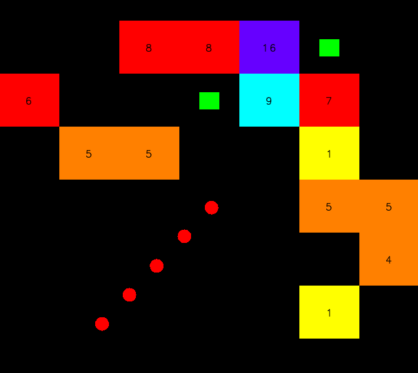
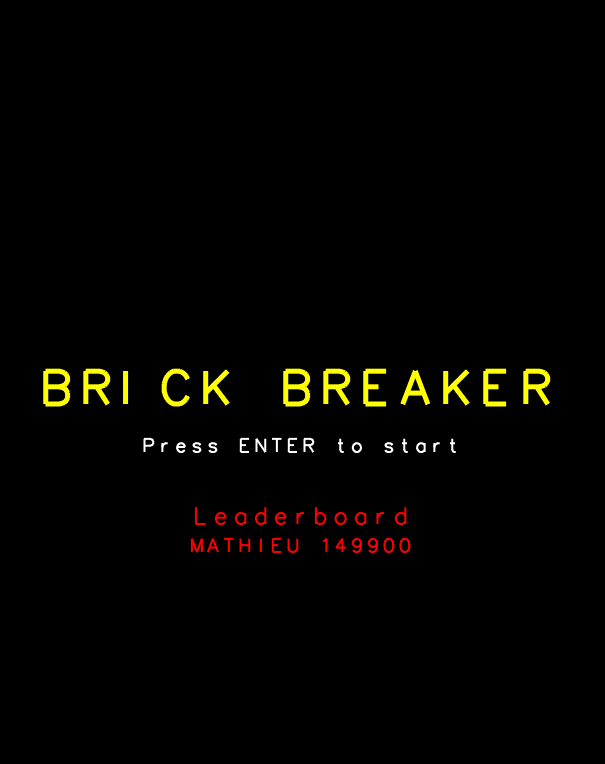

# Brick Breaker - C++ GLUT Game



## Overview
**Brick Breaker** is a minimalist C++ game using **GLUT**, featuring classic block-breaking mechanics with a simple graphical interface. This game is **already compiled** and requires no additional setup. Simply execute the provided binary.



---

## Generating the Documentation

### **Install Doxygen**
- **Linux/macOS**:  
  ```sh
  sudo apt install doxygen  # Ubuntu/Debian
  brew install doxygen      # macOS
  ```
- **Windows**: Download from [doxygen.nl](https://www.doxygen.nl/download.html) and install it.

### **Generate Documentation**
Inside the project root, run:
```sh
doxygen Doxyfile
```
This will generate the documentation inside `docs/doxygen/html/`. Open the `index.html` in your browser.
